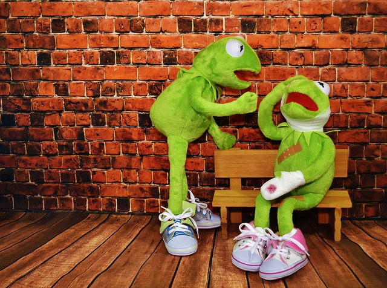

NOTE: DRAFT, not sure when I'll come back to continue this.

# Types and Domains

## TYPES AND RELATIONS


**Data types** (**types** for short) are fundamental to computer science. Every attribute of every relation is defined to be of some type, and the same is true of relvars.

A relational attribute (i.e., an attribute of a relation or relvar) can be of any type whatsoever, implying among other things that such types can be arbitrarily complex. In particular, those types can be either system or user defined. 

Two major topics:

* **Equality comparisons and “domain check override”:** That domains really are types.
* **Data value atomicity and first normal form:** That the types in question can be arbitrarily complex.

## EQUALITY COMPARISONS

The Main Differences Between an Expression and a Statement in Programming. Expressions can be assigned or used as operands, while statements can only be declared. Statements create side effects to be useful, while expressions are values or execute to values.

THE_ operators, effectively provides both (a) the domain checking we want in the first place and
(b) a way of overriding that checking, when desired, in the second place

**strong typing.** - 
(a) everything—in particular, every value and every variable—has a type, and (b) whenever we try to perform some operation, the system checks that the
operands are of the right types for the operation in question (or, possibly, that they’re coercible to
those right types). Observe, moreover, that this mechanism works for all operations, not just for
the equality comparisons 

## DATA VALUE ATOMICITY


**data value atomicity** and the related notion of **first
normal form** (`1NF` for short). 

1NF meant that every tuple in every
relation contains just a single value (of the appropriate type) in every attribute position—and it’s
usual to add that those “single values” are supposed to be “atomic.

What does it mean for data to be atomic?

Codd defines atomic data as data that “cannot be decomposed into
smaller pieces by the DBMS (excluding certain special functions).”

the notion of **atomicity has no absolute meaning;** it
just depends on what we want to do with the data. 

## WHAT’S A TYPE?


So what is a type, exactly? In essence, it’s a named, *finite* set of values—all possible values of some specific kind.

To elaborate briefly:

* The types we’re interested in are always *finite* because we’re dealing with computers,which (as pointed out in connection with type RATIONAL earlier in the chapter) are finite by definition.
* Note also that *qualifier named*: Types with different names are different types.

Moreover:

* **Every *value* is of some type** — in fact, of exactly one type, except possibly if type inheritance is supported, a concept that’s beyond the scope of this book.
* **Every variable, every attribute, every operator that returns a result, and every parameter of every operator is defined, or declared, to be of some type.** 10 And to say that, e.g., variable V is declared to be of type T means, precisely, that every value v that can legally be
assigned to V is in turn of type T.
* **Every expression denotes some value and is therefore of some type:** namely, the type of the value in question, which is to say the type of the value returned by the outermost operator in the expression (where by “outermost” I mean the operator that’s executed last). For example, the type of the expression
`( a / b ) + ( x - y )`
is the type declared for the operator “`+`”, whatever that happens to be.

**associated with every type there’s a set of operators for operating on values and variables of the type in question** — where to say that operator `Op` is “associated with” type `T` basically just means that operator `Op` has a parameter of type `T`

That defining a new type involves at least all of the following:

1. Defining a name for the type (obviously enough).
2. Defining the values that make up that type. I’ll discuss this aspect in detail in Chapter 8.
3. Defining the hidden physical representation for values of that type. As noted earlier, this is
an implementation issue, not a model issue, and I won’t discuss it further in this book (at
least, not much).
4. Defining one or more selector operators for selecting, or specifying, values of that type.
Note: Here’s as good a place as any to point out in the interest of accuracy that the
selectors for type T aren’t “associated with” type T in the sense that they have a parameter
of type T; rather, they return a result of type T.
5. Defining the operators, including in particular assignment (“:=”), equality comparison
(“=”), and THE_ operators, that apply to values and variables of that type (see below).
6. For those operators that return a result, defining the type of that result (again, see below).

points 4, 5, and 6 taken together imply that (a) the system knows precisely
which expressions are legal, and (b) for those expressions that are legal it knows the type of the
result as well.


## SCALAR vs. NONSCALAR TYPES

Types are frequently said to be either scalar or nonscalar. Loosely, a type is scalar if it has no user visible components and nonscalar otherwise.

* **scalar** - types that are neither tuple nor relation types.
* **nonscalar** - types that are either tuple or relation types.
* A *generated type* is a type that’s obtained by invoking some
type generator (in the example, the **type generator** is, specifically, RELATION). You can think of a type generator as a special kind of operator; it’s special because (a) it returns a type instead of a value, and (b) it’s invoked at compile time instead of run time. For instance, most programming languages support a type generator called ARRAY, which lets users define a variety of specific array types. For present purposes, however, the only type generators we’re interested in are TUPLE and RELATION. 

Finally, a few miscellaneous points to close this section:

* Even though tuple and relation types do have user visible components (namely, their attributes), there’s no suggestion that those components have to be physically stored as such, in the form in which they’re seen by the user. In fact, the physical representation of tuples and relations should be hidden from the user, just as it is for scalar values (recall the discussion of physical data independence in Chapter 1).
* Like scalar types, tuple and relation types certainly need associated selector operators (and literals as a special case). I’ll defer the details to the next chapter. They don’t need `THE_` operators, however; instead, they have operators that provide access to the corresponding attributes, and those operators play a role somewhat analogous to that played by `THE_` operators in connection with scalar types.
* Tuple and relation types also need assignment and equality comparison operators. I gave an example of tuple assignment earlier in the present section; I’ll defer details of the other operators—relational assignment, and tuple and relational equality comparisons—to the next chapter.

## SCALAR TYPES IN SQL

SQL supports the following more or less self-explanatory system defined
scalar types:

* BOOLEAN 
* INTEGER 
* SMALLINT 
* BIGINT 
* NUMERIC(p,q) 
* DECIMAL(p,q) 
* FLOAT(p) 
* CHARACTER(n)
* CHARACTER VARYING(n)
* CHARACTER LARGE OBJECT(n)
* BINARY(n)
* BINARY VARYING(n)
* BINARY LARGE OBJECT(n)
* DATE
* TIME
* TIMESTAMP
* INTERVAL
* XML 

## TYPE CHECKING AND COERCION IN SQL


SQL supports only a weak form of strong typing.

Thus, for example, an attempt to compare a number and a character string is illegal.

However, an attempt to compare (say) two numbers is legal, even if those numbers are of different types—say INTEGER and FLOAT.

**Strong recommendations:** Do your best to avoid coercions wherever possible. columns with the same name are always of the same type; And when they can’t be avoided, I recommend doing them explicitly,
using `CAST` or some `CAST` equivalent

Certain coercions are unfortunately built into the very fabric of SQL and so can’t be avoided. To be specific:

* If a table expression tx is used as a row subquery, then the table `t` denoted by tx is supposed to have just one row `r`, and that table `t` is coerced to that row `r`. 
* If a table expression `tx` is used as a scalar subquery, then the table t denoted by tx is supposed to have just one column and just one row and hence to contain just one value `v`, and that table `t` is doubly coerced to that value `v`. Note: This case occurs in connection with SQL-style aggregation in particular (see Chapter 7).
* In practice, the row expression `rx` in the `ALL` or `ANY` comparison `rx θ sq`—where (a) `θ` is a simple scalar comparison operator, such as “`<`” or “`>`”, followed by the keyword `ALL` or `ANY`, and (b) *sq* is a subquery—often consists of a simple scalar expression, in which case the scalar value denoted by that expression is effectively coerced to a row that contains just that scalar value. Note: Throughout this book, I use the term row expression to mean either a row subquery or a row selector invocation (where row selector in turn is my preferred term for what SQL calls a row value constructor—see Chapter 3); in other words, I use row expression to mean any expression that denotes a row, just as I use table expression to mean any expression that denotes a table. As for `ALL` or `ANY` comparisons, they’re discussed in Chapter 11.

## COLLATIONS IN SQL

A **collation**—
also known as a collating sequence—is a rule that’s associated with a specific character set and governs the comparison of strings of characters from that character set. Let C be a collation for
character set S, and let a and b be any two characters from S. Then C must be such that exactly
one of the comparisons a < b, a = b, and a > b evaluates to TRUE and the other two to FALSE
(under C).

**Recommendation:**
Don’t use PAD SPACE—always use NO PAD instead, if possible.


**Strong recommendation:** Avoid possibly nondeterministic expressions as much as you can.

## ROW AND TABLE TYPES IN SQL


SQL ROW type generator (type constructor):

```SQL
DECLARE SRV # SQL row variable
ROW ( SNO VARCHAR(5) ,
      SNAME VARCHAR(25) ,
      STATUS INTEGER ,
      CITY VARCHAR(20) ) ;
```

SQL row assignment:

```SQL
 SET SRV = ( S WHERE SNO = 'S1' ) ;
```

SQL doesn't really have a `TABLE` type generator.

`CREATE TABLE` for defining table variables. 

```SQL
CREATE TABLE S
  ( SNO    VARCHAR(5)  NOT NULL ,
    SNAME  VARCHAR(25) NOT NULL ,
    STATUS INTEGER     NOT NULL ,
    CITY   VARCHAR(20) NOT NULL ,
    UNIQUE ( SNO ) ) ;
```

Type tables. **Strong recommendation:** Don't use them, nor any features related to them.

## CONCLUDING REMARKS

* Relations can have attributes of any type whatsoever.
* The question as to what types are supported is orthogonal to the question of support for the relational model itself.
* **First normal form** just means that every tuple in every relation contains a single value, of the appropriate type, in every attribute position. 
* Certain important exceptions to the rule that relational attributes can be of any type whatsoever. Two exceptions:

1. The first is that if relation `r` is of type `T`, then no attribute of `r` can itself be of type `T` (think about it!). 
2. The second (which in fact I’ve already touched on) is that no relation in the database can have an attribute of any pointer type. 


## Credits

* First picture (tables): [https://pixabay.com/illustrations/village-city-coast-colorful-houses-8396532/](https://pixabay.com/illustrations/village-city-coast-colorful-houses-8396532/)
* [https://pixabay.com/photos/sees-it-relation-relationship-soul-4138304/](https://pixabay.com/photos/sees-it-relation-relationship-soul-4138304/)
* [https://pixabay.com/photos/atom-nuclear-power-plant-abandoned-3669818/](https://pixabay.com/photos/atom-nuclear-power-plant-abandoned-3669818/)
* [https://pixabay.com/photos/stop-violence-abuse-partner-1971756/](https://pixabay.com/photos/stop-violence-abuse-partner-1971756/) - This is the only one out of a few choices that had some sembalence of sense for Coercion. Plus I love Kermit.
* [https://pixabay.com/photos/sunrise-boat-rowing-boat-nobody-1014712/](https://pixabay.com/photos/sunrise-boat-rowing-boat-nobody-1014712/)
* [https://pixabay.com/photos/typewriter-vintage-old-1248088/](https://pixabay.com/photos/typewriter-vintage-old-1248088/)