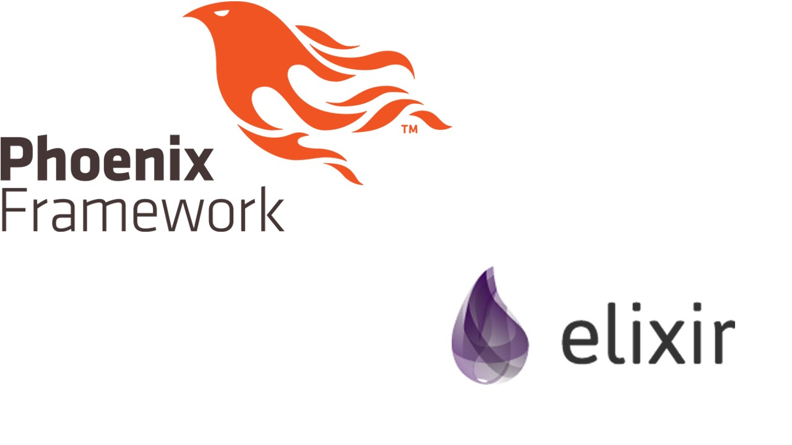

## Introduction

I recently talked to a buddy of mine and we had different view on technology. Being a veteran in the whole gamut full stack of web development I have a set of belief that I’ve come to developed toward technology stack. I didn’t fully express my view when talking to him and I’d like to put it down in words next time I have to discuss such topic.

This is also for me to have a clear, rational, and logical argument written down.

## Keeping Up To Date

Technology is always changing. There is a new frontend rendering every few months. The people on the otherside will say, “It is up to you to learn and keep up to date.” I used to believe this until the realized this:

It sounds great but the fact is when your whole stack change often enough especially when you are a full stack this become a full time job.

Frontend rendering rate of change is really really fast. That’s great if you don’t have no life, no ambition for relationship or family, etc…

The pro to frontend rendering is that we have tons of awesome stuff created by javascript community and I would argue that web component standardization was because of the cuttroat nature of flavor flav of the month frontend rendering javascript.

I am done with this rat race.

Reason being I have other personal stuff to work on. My goals have changed from making tools for other people, to making tools for me and hoping that other people will find it useful. I’m doing side projects for myself. I get to choose what I feel like reasonable regardless if it’s wrong or not. I’ll learn from my mistakes.

I am in the current mind set of learning something good and well enough that will survive in at least 2+ years from now.

Keeping up to date is always something you hear but it’s importance does not overshadow having a reliable technology.

## Let’s start with Database SQL vs NoSQL

One statement I made with my buddy is that I’m going to relearn and sharpen my relational database skillset and I’ve chosen PostgreSQL. I’ve been using the ORM libaries of MVC frameworks which abstract from the relation database. This is great but I want to be better and more focus on a piece of technology that I believe in. Plus I’m hoping to learn PostGIS in the future for temporal spatial analysis.

He wanted me to use Firebase instead of PostgreSQL.

I don’t want to do this.

One of the biggest reason is that I want to keep my data safe and I want to be in control of my data. The application logic is not the end goal. The real gold, pun intended, is the data. It takes awhile to become an authorative site and developed an active community. The data is what makes this possible. Do not give your data to third party that’s silly.

Another reason is that relational database will be here in 10 years from now. I don’t know about anything else but you can try to guess and bet on it. I won’t be taking that bet or joining that rat race.

I learned and did professionally Cassandra and MongoDB. I don’t know when and where it’ll be in a decade from now. I don’t believe it is a use case for the majority of the data out there, at least the data I care about. I’m not going to write joins manually. How well does my knowledge of column based database structure transferable to other databases? I think SQL is much more transferable than CQL.

When you find yourself doing relational joins and doing nothing with text search in Elasticsearch, Solr, or any Lucene-based database then you’re doing it wrong.

I can go into B+ trees vs trie but I get paid for that when I did consulting and it’s a huge discussion in itself.

It should be the responsibility of the programmer to do a pro and con. Often time than not, those programmers are chasing hype and money. That is fine. I don’t want to be the person getting stuck maintaining such choices when it goes out of vogue. Inheriting technical debt is not fun and if I have the choice then I choose no. Go out there and test those fancy new technology. I’ll wait until they are battle tested, I’ll wait until it’s boring like Ruby on Rails is now.

The majority of the data out there are relational. Use a relational database and if you want to gamble try one of the graph database. Also the big data hype is dying down. The majority of the data out there are not big. You don’t need fancy convoluted tech stacks for your small data. If you want to juggle and maintain convoluted tech stacks all day then sure.

## Back to Frontend Rendering Javascript Framework

Another technology that keeps on changing is frontend rendering javascript frameworks. I am basically done with this, I went from ember.js, angular.js, and now to Vue.js. I’ll come back when it’s boring. I’ll come back when there are clear winners.

I’ve highlight the reasons above. Other reason such as the sketchy security issue of npm packages. Or SEO for frontend rendering sucks, it is a bunch of hacks. Supposely Google got something that can handle crawling that. No thanks, I don’t need more headaches. SSR for me.

I’ve chosen a server side/backend rendering MVC framework, Phoenix and Elixir programming language and call it a day. It’s a small community, the changes aren’t often, and more importantly it’s boring. I am pretty sure it’ll be here at least 2 years from now. It is a bet on my part on this technology but SSR aren’t changing as fast as FSR.

I also dislike the Node.JS concurrecy model. I prefer Erlang’s actor model. It’s easier to think and debug. I don’t have to do hand threads myself or catch possible error cases. I can just let it crash and only catch cases that I want in Erlang.

## OS

As for OS, I’m going for OpenBSD. I want to master an OS and I find that linux is increasingly complicated.

Which is fine but I want to know the in’s and out’s of my OS and OpenBSD is boring enough for me. It is small enough for me to figure out all the processes and what the hell is going on.I can tailor it to my developing machine without unnecessary bloat and blobs (heh). OpenBSD also have all the programming languages support I care about (Elixir, NPM,Python, R). I wish it have a better filesystem but I know it’ll work years from now. I’ll wait for Hammer2 and dream about a port over to OpenBSD one day.

I have stopped doing rat races and refocus on what I care about and this is my new technology stack for my side projects:

<ol>
<li>OpenBSD</li>
<li>PostgreSQL</li>
<li>Phoenix + Elixir</li>
</ol>

This is my rationality and hopefully there are some wisdoms in these.

## Etc…

<ul>
<li>First picture: https://pixabay.com/en/users/RobinHiggins-1321953</li>
<li>Last picture: https://pixabay.com/en/grimace-girl-teen-mimicry-brutal-1012862/</li>
</ul>
